<picture>
  
</picture>

  <a href="https://t.me/KarnaukhovGA"><strong>Telegram</strong></a> &nbsp; / &nbsp;
  <a href="mailto:karnaukhovglebwork@gmail.com"><strong>Почта</strong></a> &nbsp; / &nbsp;
  <a href="https://github.com/karnaukhovGA69?tab=repositories"><strong>Репозитории</strong></a>

**Go/C++ Developer. Go — основной язык.** Разрабатываю backend-сервисы, API и интеграции. Стажировался в **Яндексе**, в команде **Яндекс Про · Driver Online / Orders**. Учусь на программной инженерии в **НИУ ВШЭ**.

### Опыт · Яндекс

- Проектировал и разрабатывал API для взаимодействия сервисов.
- Разрабатывал сценарии работы сервисов через динамические конфигурации.
- Переписывал legacy-сервис с переносом функциональности в новые сервисы.
- Повышал безопасность и отказоустойчивость сервиса уровня **Tier-A**.
- Разработал на **Go** восстановление истории партнёрских заказов: события из YTsaurus, очередь задач и интеграция с админкой поддержки.

### Основной стек

**Go** · C++ · PostgreSQL · Kafka · RabbitMQ · Docker

REST · gRPC / Protobuf · WebSocket · SQL · Git · CI/CD

Другие технологии

Python, Lua, userver, AppHost, YTsaurus, pytest, unit-тесты.

### Избранные проекты

Учебные проекты и тестовые задания на Go.

| Проект | Что внутри |
| :--- | :--- |
| **[Платёжная система ↗](https://github.com/karnaukhovGA69/HW4_KPO)** Go · PostgreSQL · RabbitMQ | Сервисы Orders и Payments, отдельные базы данных, Transactional Outbox / Inbox, идемпотентная обработка сообщений и статусы заказов через WebSocket. |
| **[Поисковые тренды ↗](https://github.com/karnaukhovGA69/WB_Test_Task)** Go · Kafka · gRPC · Prometheus | Популярные запросы за последние пять минут: поток событий из Kafka, скользящее окно, кэш Top-N, динамический стоп-лист и метрики. |
| **[Антиплагиат ↗](https://github.com/karnaukhovGA69/HW3_KPO)** Go · PostgreSQL · REST | Три сервиса — Storage, Analysis и Gateway. Хранение работ и отчётов в отдельных базах, объединение ответов через API Gateway. |

### Образование

**НИУ ВШЭ** · Программная инженерия · Бакалавриат · 2024 — настоящее время.

Курсы и английский

- **VK Education** — «Разработка веб-сервисов на Go».
- **Яндекс Лицей** — разработка микросервисов на Go; Go-1, Go-2, Go-3.
- **Английский** — Intermediate (B1).

---

Интересуюсь надёжностью сервисов, распределёнными системами, асинхронной обработкой событий и алгоритмами.
